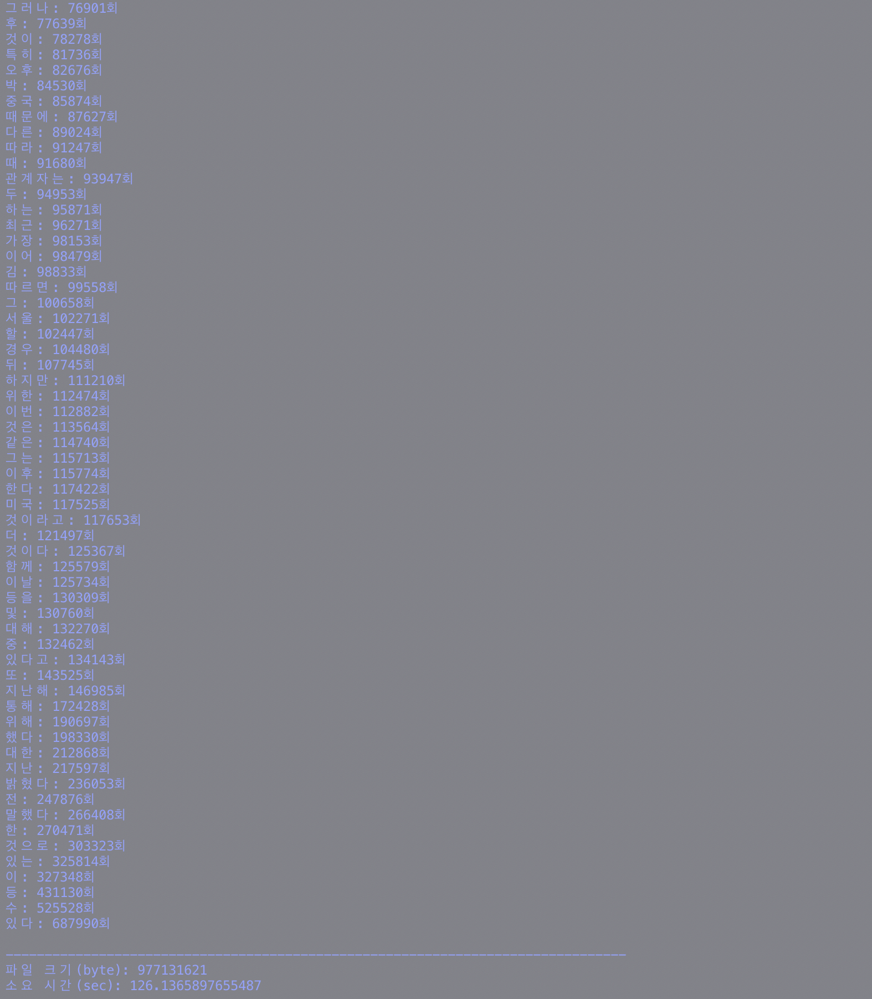

## [실습 과제] 어절빈도 조사

파이썬의 연관배열 사용하여 어절빈도 계산 프로그램을 작성하고 테스트하세요.
  - 입력: 텍스트 파일
  - 출력: 각 어절들의 빈도수 (한 라인에 어절 하나씩)

     예) freq1 : word1 \n freq2 : word2 \n ...

  - 추가: 작성한 프로그램이 문제없이 작동하는 가장 큰 파일의 크기 및 실행시간을 출력

---

* Run (Unix)

```shell
make
```

* Run (Windows)
```shell
python src/wordFrequency.py
```

---

## 실행 결과


